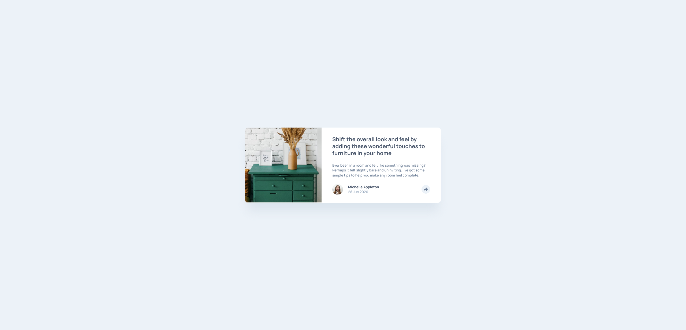

# Frontend Mentor - Article preview component solution

This is a solution to the [Article preview component challenge on Frontend Mentor](https://www.frontendmentor.io/challenges/article-preview-component-dYBN_pYFT). Frontend Mentor challenges help you improve your coding skills by building realistic projects. 

## Table of contents

- [Overview](#overview)
  - [The challenge](#the-challenge)
  - [Screenshot](#screenshot)
  - [Links](#links)
- [My process](#my-process)
  - [Built with](#built-with)
  - [What I learned](#what-i-learned)
  - [Continued development](#continued-development)
- [Author](#author)

## Overview

### The challenge

Users should be able to:

- View the optimal layout for the component depending on their device's screen size
- See the social media share links when they click the share icon

### Screenshot

### Links

- Solution URL: [https://github.com/Leonardo76/article-preview.git](https://github.com/Leonardo76/article-preview.git)
- Live Site URL: [https://article-previewfm.netlify.app](https://article-previewfm.netlify.app)

## My process

### Built with

- Semantic HTML5 markup
- CSS custom properties
- Flexbox
- CSS Grid
- SCSS
- Mobile-first workflow
- [React](https://reactjs.org/) - JS library
- [Tailwind](https://tailwindcss.com/) - For styling (and some CSS resets)
- [Classnames](https://jedwatson.github.io/classnames/) - For conditionally joining classNames together
- [react-responsive](https://github.com/yocontra/react-responsive) - For dynamically detecting  media/device type

### What I learned

There is still a problem with individually styling components. The CSS are mixing up in the end even if I used SCSS (online it is said that SCSS is one of the method that can be used for keeping CSS file separated; I tried the module technique but it doesn't work).

### Continued development

Individually styling React components.

## Author

- Frontend Mentor - [@Leonardo76](https://www.frontendmentor.io/profile/Leonardo76)

